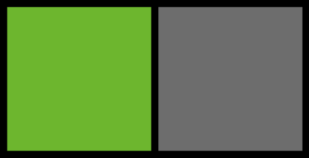
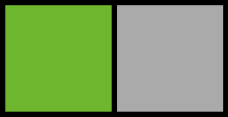

> 
>
> A video demo of CIELab.io. You can see the real thing live here:
>
> https://cielab.io

# [CIELab.io](https://cielab.io)

**CIELab.io** is a color tool based on human perception. CIELab.io lets you work
with colors based on human perception, instead of based on how screens display
them.

With CIELab.io, you can:

* Explore a selected set of color palettes from various brands and design
  systems, and see how they look in CIELab.
* Build your own color palette, visualize it in CIELab, and export it into code.

This project is deeply indebted to related work from Stripe, blogged about in
[*Designing accessible color
systems*](https://stripe.com/blog/accessible-color-systems) by Daryl Koopersmith
and Wilson Miner. CIELab.io is inspired by the screenshots in that blog post.

## What is "CIELab"?

If you're a web developer or designer, you're probably familiar with RGB. In the
context of the web, "RGB" refers to [*sRGB*][srgb] ("Standard Red-Green-Blue").
sRGB is a *color space*, an arragement of colors. sRGB arranges colors based on
how much red, green, and blue light combined is needed to display a given color.

[srgb]: https://en.wikipedia.org/wiki/SRGB

For designers, sRGB has a big problem: it's optimized for monitors and
printers, and human perception does not work like those machines. In particular,
"distance" in sRGB does not correspond to what humans think of distance between
colors. Humans are more sensitive to certain colors than others, and sRGB is not
designed to fully account for this.

For example, here are two colors which in RGB are the same distance from white:

For most people, these two colors do not appear to be equally "bright", despite
being equidistant (in sRGB space) from white. The color on the left seems
brighter.

CIELab (also spelled *CIELAB*, *CIE La\*b\**, or *Lab*) is a color space based
on human perception. Instead of using Red, Green, and Blue as the "axes", CIELab
uses Lightness (Black/White), "a" (Green/Red), and "b" (Blue/Yellow). Unlike in
sRGB, in CIELAB distance is meaingful.

For example, here's that same example as before, but with the color on the right modified so that its "Lightness" dimension equals the "Lightness" on the left:

For most people, these colors now seem to be equally visually bright. This is an
important feature for designers, because it means that if two buttons with these
colors were side by side, they would have equal visual weight.

## What are "Chroma" and "Hue"?

When you use CIELab.io, you'll run into the terms "Chroma" and "Hue". These are
the radial-coordinate counterpart to the Cartesian-coordinate "a" and "b" in
CIELab. Chroma ("c") and Hue ("h"), together with Luminance ("L") from CIELab,
construct the *CIELch* space.

The previous section explains why CIELab is, for designers, a more useful
version of RGB. Think of CIELch as being like the familiar HSL
(Hue-Saturation-Lightness), but for CIELab instead of RGB. You preserve the
human-centric nature of CIELab, but also enjoy HSL concepts like the color
wheel.
